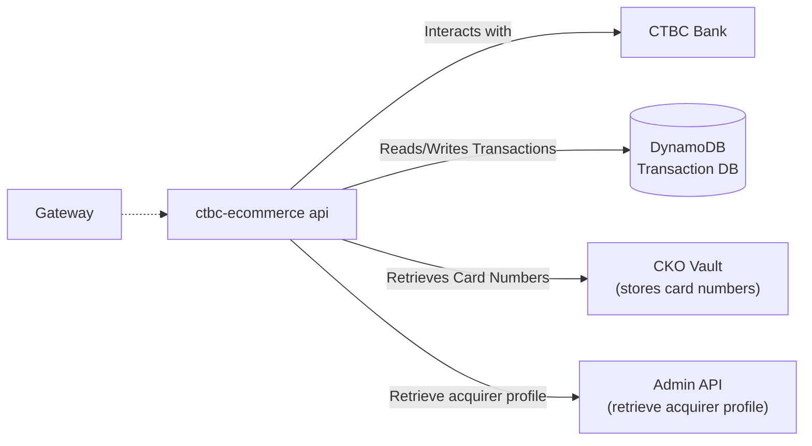
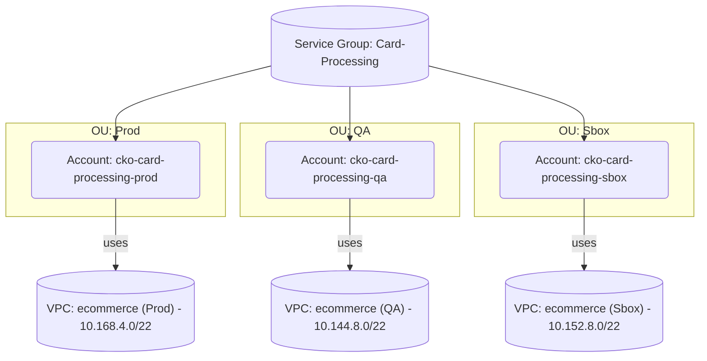
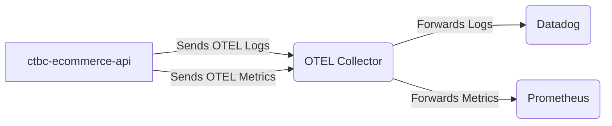
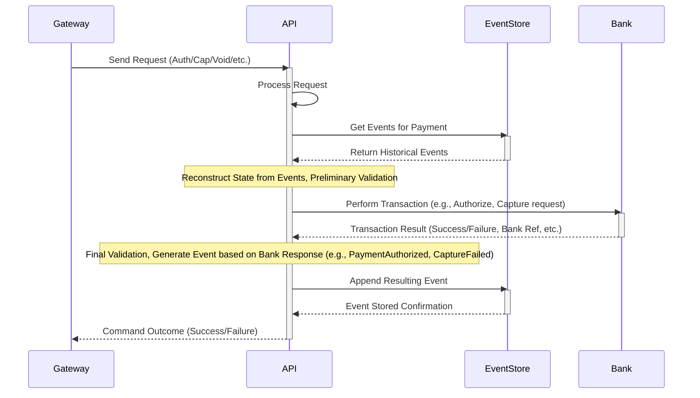

## Who Are We

- We are a new team called **Geo**
- Responsible for helping to expand Checkout capabilities around the world
   
---  
  
## UBER - CTBC
  
- CTBC (formerly China Trust Comercial Bank ) is a Taiwanese bank
- Checkout is acting as a payment gateway to serve Uber payments in Taiwan

---
## Architecture Overview



---  
## AWS 3rd Gen  


   
   
---
## Harness

- Deployment pipeline
- Has some state for environment configurations,  pipeline executions...etc
- Calls AWS API to deploy services
- Each environment can have its own deployment configuration
- Related services should be grouped into a single `config.json`

---
## Harness

Create IAC config file here: https://github.com/cko-core-platform/harness-projects-iac
```json
{
    "product_name": "CTBC Ecommerce API",
    "product_tag": "ctbc-ecommerce-api",
    "description": "CTBC Ecommerce API",
    "service_group": "Card Payments",
    "environments": {
      "qa": {
        "account_id": "688567275994"
      },
      "sbox": {
        "account_id": "122610476149"
      },
      "prod": {
        "account_id": "051826707909"
      }
    },
    "services": {
      "ctbc-ecommerce-api": {
        "type": "ecs",
        "regions": ["eu-west-1"],
        "name": "CTBC Ecommerce API",
        "description": "CTBC Ecommerce API ECS Service",
        "artifact_account_id": "791259062566",
        "image_uri": "card-payments/ctbc-ecommerce-api/api",
        "container_name_or_prefix": "ctbc-ecommerce-api",
        "auto_deploy_to_first_stage": "true",
        "deployment_config": {
          "qa": {
            "enable_stage": "true",
            "eu-west-1": {
              "cluster_name": "ctbc-ecommerce-api",
              "live_rule_arn": ["arn:aws:elasticloadbalancing:eu-west-1:711533748762:listener-rule/app/ctbc-ecommerce-api/676a06aef132680e/8a0c428ef8ab03dd/bf08af481e2fe63b"],
              "staging_rule_arn": ["arn:aws:elasticloadbalancing:eu-west-1:711533748762:listener-rule/app/ctbc-ecommerce-api/676a06aef132680e/8a0c428ef8ab03dd/ca0662228c81611d"]
            },
            "traffic_shift_percentages": ["100:0"]
          },
          "sbox": {
            "enable_stage": "true",
            "eu-west-1": {
              "cluster_name": "ctbc-ecommerce-api",
              "live_rule_arn": ["arn:aws:elasticloadbalancing:eu-west-1:686496747715:listener-rule/app/ctbc-ecommerce-api/167f507e8d7ea2a5/b6defb745387b3a4/35b21217088bd28f"],
              "staging_rule_arn": ["arn:aws:elasticloadbalancing:eu-west-1:686496747715:listener-rule/app/ctbc-ecommerce-api/167f507e8d7ea2a5/b6defb745387b3a4/ab33878f3e716963"]
            },
            "traffic_shift_percentages": ["100:0"]
          },
          "prod": {
            "eu-west-1": {
              "cluster_name": "ctbc-ecommerce-api",
              "live_rule_arn": ["arn:aws:elasticloadbalancing:eu-west-1:851392519502:listener-rule/app/ctbc-ecommerce-api/2f030f975d99d901/866a0f53750b3995/ac383c3166ef8ddf"],
              "staging_rule_arn": ["arn:aws:elasticloadbalancing:eu-west-1:851392519502:listener-rule/app/ctbc-ecommerce-api/2f030f975d99d901/866a0f53750b3995/ca0898d202cc0e61"]
            },
            "traffic_shift_percentages": ["10:90", "50:50", "100:0"] 
          }
        },
        "trigger_enabled": "true"
      }
    }
}
```

---
## Harness

- For ECS, you MUST have a lambda that verifies deployment. 

``` bash
#!/bin/bash
# Verify QA Deployment
API_URL="https://ctbc-ecommerce-api.internal" 
JSON_PAYLOAD=$(cat <<EOF
{
  "cko_vault_id": "9c5b004c-7516-4c4f-a3b7-3c00aa91197b"
  ...
}
EOF
)

EXPECTED_STATUS_CODE=200
response_output=$(curl -s -X POST \
     -H "Content-Type: application/json" \
     -d "$JSON_PAYLOAD" \
     -w "\n%{http_code}" \
     "$API_URL")

if [ $? -ne 0 ]; then
  echo "Error: curl command failed. Check network or URL."
  exit 1
fi

response_body=$(echo "$response_output" | sed '$d')
http_status_code=$(echo "$response_output" | tail -n 1)

echo "-------------------------------------"
echo "Response Status Code: $http_status_code"
echo "Response Body:"
echo "$response_body"
echo "-------------------------------------"

if [ "$http_status_code" -ne "$EXPECTED_STATUS_CODE" ]; then
  echo "Authentication Failed: Unexpected HTTP status code $http_status_code (Expected $EXPECTED_STATUS_CODE)."
  exit 1
fi

echo "HTTP Status Code ($http_status_code) is OK."
```


---
## OTEL




---
## Monorepo Design

```
ctbc-ecommerce-api/
├── .gitignore
├── README.md
├── CTBC.Ecommerce.sln
│
├── IaC/
│   ├── components/
│   └── variables/
│
└── src/
    ├── CTBC.Ecommerce.Api/
    │   ├── health/
    │   │   └── CustomHealthCheck.cs
    │   ├── appsettings.json
    │   ├── Program.cs
    │   └── CTBC.Ecommerce.Api.csproj
    │
    ├── ...
    │
    └── tests/
        └── CTBC.Ecommerce.Api.Tests/
            └── ApiEndpointTests.cs
            └── CTBC.Ecommerce.Api.Tests.csproj
```

---
## Monorepo Design

- Harness IAC does not live in the `ctbc-ecommerce-api` repo
- Monitoring IAC does not live in the `ctbc-ecommerce-api repo

---
## Authentication

- Other services connect via
	- TLS over VPN (client side auth) - ISO 8583 
	- TLS over https (client side auth)
- CTBC uses TLS (server auth only) with a TripleDES encrypted payload inside the tunnel on the client side client for auth

---
## Event Sourcing




