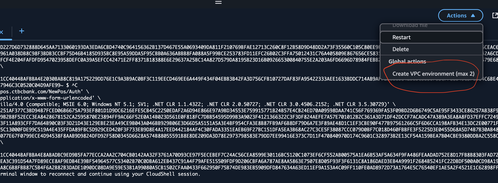

- Log into AWS GUI using `cko-card-processing-qa` account
- Click `Cloudshell`
- Create new VPC

![[Pasted image 20250423154017.png]]

- Send Request, e.g:
```bash
curl 'https://testepos.ctbcbank.com/NewPos/Auth' \
  -H 'Content-Type: application/x-www-form-urlencoded' \
  -H 'User-Agent: Mozilla/4.0 (compatible; MSIE 6.0; Windows NT 5.1; SV1; .NET CLR 1.1.4322; .NET CLR 2.0.50727; .NET CLR 3.0.4506.2152; .NET CLR 3.5.30729)' \
  --data-raw 'ApiEnc=251AF377C3BD94B7FCED06B6675A793EF801D1D9DC6216EFE5CB45C2250EDAF2A6D94E866E97A9BD34553E759915771B24B57E4CB24ED70A09598DAA741C56F769369FA53F09BD2D6B6749C5AE95F3433CE86257AB38F97F33053D20818D6136A9216F44FF9B2B8F52ECC3EA8428678152CA2595870E23894FF9AC66F52E0A14B023D561E0F818FC7DBB54595D99B3A9023F4121366322C3F3DF824AEFE7A57E701012B2C361A3D71DF42DCCF7ACADC47A389A3EA8A8FD37EFFC7249AE1E59129734E7EBE82C2D55AAE3F11A893CFF7DA64B90C03F3D21D43E129EBE23EA49CE9B043A046BB929B06E3D66D5A5151A5A3E4BF954CFA3E8B87FB9AF6B8DF79D6A7E3F89AE48D1C1EF3CBE90F477B97561266C5F6D6CCA198AFB34E13DC2E00771F538AFF11664097521AC7CDFC8F55C13000FDE99C519A4E435FFDA89FBC5D929CED420F3F733EB9D8E4A17EED442184AF4C30FADA3351EAEB69F27BC151DFA5EA3B68AC27C3CE5F38087CCC079D0BF7C018D460FBBFE3F5225D3E0455D68A5D74B7B30AB4895801CF4F0DE859647ED8EC4F12077E67F0799ECE4D94538F8AAB9D9824DFD92F58D0345D6628A574B88055591B8E8DE209DA3D78E2973798583E79DD7EE99416E373C7D11F470840970D174C9601C328973B2E13CF54A159BEA7B04CBE9380DDBA2C558C94EDCDD15E43E&MERID=80102' \
  --compressed
```
