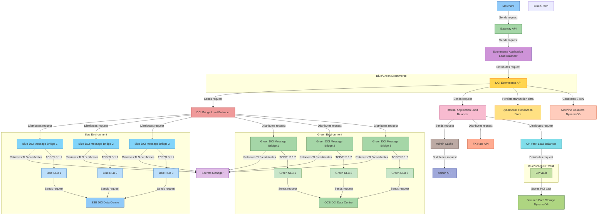

```mermaid
graph TD
    Merchant[Merchant] -->|Sends request| GatewayAPI[Gateway API]
    GatewayAPI -->|Sends request| EcommerceLoadBalancer[Ecommerce Application Load Balancer]
    EcommerceLoadBalancer -->|Distributes request| DCIEcommerceAPI[DCI Ecommerce API]
    DCIEcommerceAPI -->|Sends request| DCIBridgeLoadBalancer[DCI Bridge Load Balancer]
    DCIEcommerceAPI -->|Sends request| InternalLoadBalancer[Internal Application Load Balancer]
    DCIEcommerceAPI -->|Persists transaction data| DynamoDB[DynamoDB Transaction Store]
    DCIEcommerceAPI -->|Generates STAN| MachineCountersDB[Machine Counters DynamoDB]
    InternalLoadBalancer -->|Sends request| AdminCache[Admin Cache]
    AdminCache -->|Distributes request| AdminAPI[Admin API]
    InternalLoadBalancer -->|Distributes request| FXRateAPI[FX Rate API]
    InternalLoadBalancer -->|Distributes request| CPVaultAPI[CP Vault Load Balancer]
    
    CPVaultAPI -->|Distributes request| CPVault[CP Vault]
    CPVault -->|Stores PCI data| SecuredCardStorage[Secured Card Storage DynamoDB]
    
    %% Blue Environment Message Bridges
    DCIBridgeLoadBalancer -->|Distributes request| BlueDCIMessageBridge1[Blue DCI Message Bridge 1]
    DCIBridgeLoadBalancer -->|Distributes request| BlueDCIMessageBridge2[Blue DCI Message Bridge 2]
    DCIBridgeLoadBalancer -->|Distributes request| BlueDCIMessageBridge3[Blue DCI Message Bridge 3]
    
    %% Green Environment Message Bridges
    DCIBridgeLoadBalancer -->|Distributes request| GreenDCIMessageBridge1[Green DCI Message Bridge 1]
    DCIBridgeLoadBalancer -->|Distributes request| GreenDCIMessageBridge2[Green DCI Message Bridge 2]
    DCIBridgeLoadBalancer -->|Distributes request| GreenDCIMessageBridge3[Green DCI Message Bridge 3]
    
    %% Blue Message Bridges TLS certificates
    BlueDCIMessageBridge1 -->|Retrieves TLS certificates| SecretsManager[Secrets Manager]
    BlueDCIMessageBridge2 -->|Retrieves TLS certificates| SecretsManager
    BlueDCIMessageBridge3 -->|Retrieves TLS certificates| SecretsManager
    
    %% Green Message Bridges TLS certificates
    GreenDCIMessageBridge1 -->|Retrieves TLS certificates| SecretsManager
    GreenDCIMessageBridge2 -->|Retrieves TLS certificates| SecretsManager
    GreenDCIMessageBridge3 -->|Retrieves TLS certificates| SecretsManager
    
    %% Blue Message Bridges to Network Load Balancers
    BlueDCIMessageBridge1 -->|TCP/TLS 1.2| BlueNetworkLoadBalancer1[Blue NLB 1]
    BlueDCIMessageBridge2 -->|TCP/TLS 1.2| BlueNetworkLoadBalancer2[Blue NLB 2]
    BlueDCIMessageBridge3 -->|TCP/TLS 1.2| BlueNetworkLoadBalancer3[Blue NLB 3]
    
    %% Green Message Bridges to Network Load Balancers
    GreenDCIMessageBridge1 -->|TCP/TLS 1.2| GreenNetworkLoadBalancer1[Green NLB 1]
    GreenDCIMessageBridge2 -->|TCP/TLS 1.2| GreenNetworkLoadBalancer2[Green NLB 2]
    GreenDCIMessageBridge3 -->|TCP/TLS 1.2| GreenNetworkLoadBalancer3[Green NLB 3]
    
    %% Blue Network Load Balancers to SSB DCI Data Centre
    BlueNetworkLoadBalancer1 -->|Sends request| SSBDCIDataCentre[SSB DCI Data Centre]
    BlueNetworkLoadBalancer2 -->|Sends request| SSBDCIDataCentre
    BlueNetworkLoadBalancer3 -->|Sends request| SSBDCIDataCentre
    
    %% Green Network Load Balancers to OCB DCI Data Centre
    GreenNetworkLoadBalancer1 -->|Sends request| OCBDCIDataCentre[OCB DCI Data Centre]
    GreenNetworkLoadBalancer2 -->|Sends request| OCBDCIDataCentre
    GreenNetworkLoadBalancer3 -->|Sends request| OCBDCIDataCentre
    
    subgraph Blue/Green Ecommerce
        DCIEcommerceAPI
    end
    
    subgraph Blue Environment
        BlueDCIMessageBridge1
        BlueDCIMessageBridge2
        BlueDCIMessageBridge3
        BlueNetworkLoadBalancer1
        BlueNetworkLoadBalancer2
        BlueNetworkLoadBalancer3
        SSBDCIDataCentre
    end
    
    subgraph Green Environment
        GreenDCIMessageBridge1
        GreenDCIMessageBridge2
        GreenDCIMessageBridge3
        GreenNetworkLoadBalancer1
        GreenNetworkLoadBalancer2
        GreenNetworkLoadBalancer3
        OCBDCIDataCentre
    end
    
    subgraph Blue/Green CP Vault
        CPVault
    end
    
    style Merchant fill:#90CAF9,stroke:#0D47A1
    style GatewayAPI fill:#A5D6A7,stroke:#1B5E20
    style EcommerceLoadBalancer fill:#CE93D8,stroke:#4A148C
    style InternalLoadBalancer fill:#F8BBD0,stroke:#AD1457
    style DCIEcommerceAPI fill:#FFD54F,stroke:#FF6F00
    style DCIBridgeLoadBalancer fill:#EF9A9A,stroke:#B71C1C
    style BlueDCIMessageBridge1 fill:#81D4FA,stroke:#01579B
    style BlueDCIMessageBridge2 fill:#81D4FA,stroke:#01579B
    style BlueDCIMessageBridge3 fill:#81D4FA,stroke:#01579B
    style GreenDCIMessageBridge1 fill:#A5D6A7,stroke:#1B5E20
    style GreenDCIMessageBridge2 fill:#A5D6A7,stroke:#1B5E20
    style GreenDCIMessageBridge3 fill:#A5D6A7,stroke:#1B5E20
    style BlueNetworkLoadBalancer1 fill:#BBDEFB,stroke:#1565C0
    style BlueNetworkLoadBalancer2 fill:#BBDEFB,stroke:#1565C0
    style BlueNetworkLoadBalancer3 fill:#BBDEFB,stroke:#1565C0
    style GreenNetworkLoadBalancer1 fill:#C8E6C9,stroke:#2E7D32
    style GreenNetworkLoadBalancer2 fill:#C8E6C9,stroke:#2E7D32
    style GreenNetworkLoadBalancer3 fill:#C8E6C9,stroke:#2E7D32
    style SSBDCIDataCentre fill:#90CAF9,stroke:#0D47A1
    style OCBDCIDataCentre fill:#A5D6A7,stroke:#1B5E20
    style CPVaultAPI fill:#80DEEA,stroke:#006064
    style CPVault fill:#C5E1A5,stroke:#33691E
    style FXRateAPI fill:#FFAB91,stroke:#BF360C
    style AdminAPI fill:#9FA8DA,stroke:#283593
    style AdminCache fill:#BCAAA4,stroke:#3E2723
    style DynamoDB fill:#FFE082,stroke:#FF8F00
    style MachineCountersDB fill:#FFCCBC,stroke:#D84315
    style SecretsManager fill:#E1BEE7,stroke:#6A1B9A
    style SecuredCardStorage fill:#AED581,stroke:#33691E
    style Blue/Green Ecommerce stroke-dasharray: 5 5
    style Blue/Green CP Vault stroke-dasharray: 5 5

```

