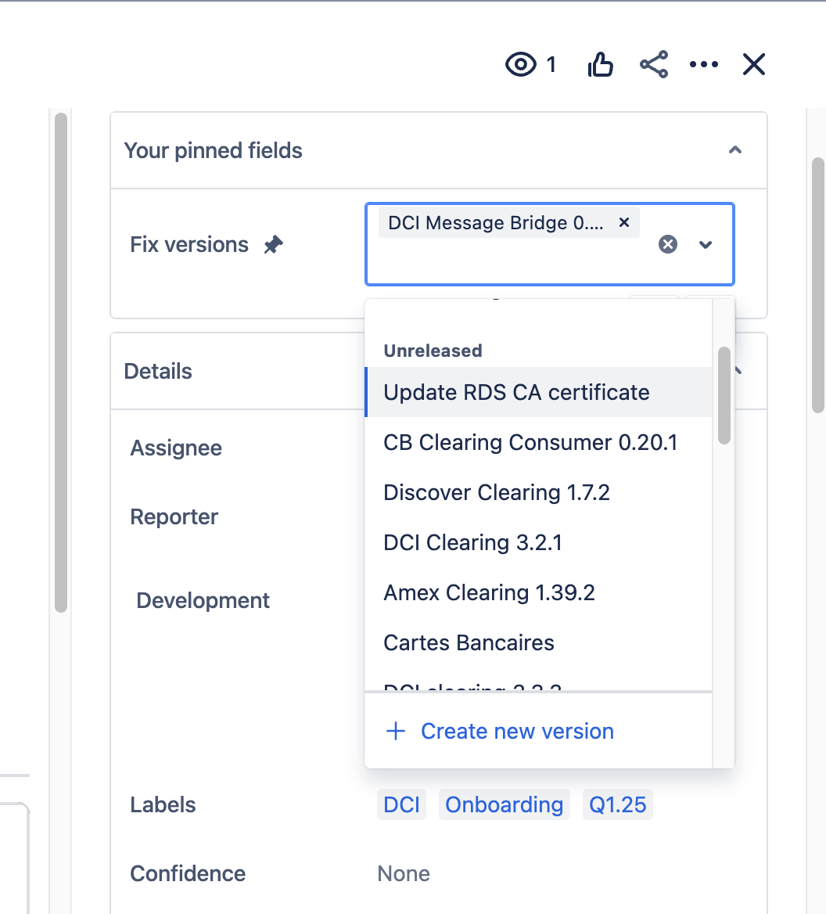

```mermaid
graph TD
    Merchant[Merchant] -->|Sends request| GatewayAPI[Gateway API]
    GatewayAPI -->|Sends request| EcommerceLoadBalancer[Ecommerce Application Load Balancer]
    EcommerceLoadBalancer -->|Distributes request| DCIEcommerceAPI[DCI Ecommerce API]
    DCIEcommerceAPI -->|Sends request| DCIBridgeLoadBalancer[DCI Bridge Load Balancer]
    DCIEcommerceAPI -->|Sends request| InternalLoadBalancer[Internal Application Load Balancer]
    DCIEcommerceAPI -->|Persists transaction data| DynamoDB[DynamoDB Transaction Store]
    DCIEcommerceAPI -->|Generates STAN| MachineCountersDB[Machine Counters DynamoDB]
    InternalLoadBalancer -->|Sends request| AdminCache[Admin Cache]
    AdminCache -->|Distributes request| AdminAPI[Admin API]
    InternalLoadBalancer -->|Distributes request| FXRateAPI[FX Rate API]
    InternalLoadBalancer -->|Distributes request| CPVaultAPI[CP Vault Load Balancer]
    
    CPVaultAPI -->|Distributes request| CPVault[CP Vault]
    CPVault -->|Stores PCI data| SecuredCardStorage[Secured Card Storage DynamoDB]
    
    %% Blue Environment Message Bridges
    DCIBridgeLoadBalancer -->|Distributes request| BlueDCIMessageBridge1[Blue DCI Message Bridge 1]
    DCIBridgeLoadBalancer -->|Distributes request| BlueDCIMessageBridge2[Blue DCI Message Bridge 2]
    DCIBridgeLoadBalancer -->|Distributes request| BlueDCIMessageBridge3[Blue DCI Message Bridge 3]
    
    %% Green Environment Message Bridges
    DCIBridgeLoadBalancer -->|Distributes request| GreenDCIMessageBridge1[Green DCI Message Bridge 1]
    DCIBridgeLoadBalancer -->|Distributes request| GreenDCIMessageBridge2[Green DCI Message Bridge 2]
    DCIBridgeLoadBalancer -->|Distributes request| GreenDCIMessageBridge3[Green DCI Message Bridge 3]
    
    %% Blue Message Bridges TLS certificates
    BlueDCIMessageBridge1 -->|Retrieves TLS certificates| SecretsManager[Secrets Manager]
    BlueDCIMessageBridge2 -->|Retrieves TLS certificates| SecretsManager
    BlueDCIMessageBridge3 -->|Retrieves TLS certificates| SecretsManager
    
    %% Green Message Bridges TLS certificates
    GreenDCIMessageBridge1 -->|Retrieves TLS certificates| SecretsManager
    GreenDCIMessageBridge2 -->|Retrieves TLS certificates| SecretsManager
    GreenDCIMessageBridge3 -->|Retrieves TLS certificates| SecretsManager
    
    %% Blue Message Bridges to Network Load Balancers
    BlueDCIMessageBridge1 -->|TCP/TLS 1.2| BlueNetworkLoadBalancer1[Blue NLB 1]
    BlueDCIMessageBridge2 -->|TCP/TLS 1.2| BlueNetworkLoadBalancer2[Blue NLB 2]
    BlueDCIMessageBridge3 -->|TCP/TLS 1.2| BlueNetworkLoadBalancer3[Blue NLB 3]
    
    %% Green Message Bridges to Network Load Balancers
    GreenDCIMessageBridge1 -->|TCP/TLS 1.2| GreenNetworkLoadBalancer1[Green NLB 1]
    GreenDCIMessageBridge2 -->|TCP/TLS 1.2| GreenNetworkLoadBalancer2[Green NLB 2]
    GreenDCIMessageBridge3 -->|TCP/TLS 1.2| GreenNetworkLoadBalancer3[Green NLB 3]
    
    %% Blue Network Load Balancers to SSB DCI Data Centre
    BlueNetworkLoadBalancer1 -->|Sends request| SSBDCIDataCentre[SSB DCI Data Centre]
    BlueNetworkLoadBalancer2 -->|Sends request| SSBDCIDataCentre
    BlueNetworkLoadBalancer3 -->|Sends request| SSBDCIDataCentre
    
    %% Green Network Load Balancers to OCB DCI Data Centre
    GreenNetworkLoadBalancer1 -->|Sends request| OCBDCIDataCentre[OCB DCI Data Centre]
    GreenNetworkLoadBalancer2 -->|Sends request| OCBDCIDataCentre
    GreenNetworkLoadBalancer3 -->|Sends request| OCBDCIDataCentre
    
    subgraph Blue/Green Ecommerce
        DCIEcommerceAPI
    end
    
    subgraph Blue Environment
        BlueDCIMessageBridge1
        BlueDCIMessageBridge2
        BlueDCIMessageBridge3
        BlueNetworkLoadBalancer1
        BlueNetworkLoadBalancer2
        BlueNetworkLoadBalancer3
        SSBDCIDataCentre
    end
    
    subgraph Green Environment
        GreenDCIMessageBridge1
        GreenDCIMessageBridge2
        GreenDCIMessageBridge3
        GreenNetworkLoadBalancer1
        GreenNetworkLoadBalancer2
        GreenNetworkLoadBalancer3
        OCBDCIDataCentre
    end
    
    subgraph Blue/Green CP Vault
        CPVault
    end
    
    style Merchant fill:#90CAF9,stroke:#0D47A1
    style GatewayAPI fill:#A5D6A7,stroke:#1B5E20
    style EcommerceLoadBalancer fill:#CE93D8,stroke:#4A148C
    style InternalLoadBalancer fill:#F8BBD0,stroke:#AD1457
    style DCIEcommerceAPI fill:#FFD54F,stroke:#FF6F00
    style DCIBridgeLoadBalancer fill:#EF9A9A,stroke:#B71C1C
    style BlueDCIMessageBridge1 fill:#81D4FA,stroke:#01579B
    style BlueDCIMessageBridge2 fill:#81D4FA,stroke:#01579B
    style BlueDCIMessageBridge3 fill:#81D4FA,stroke:#01579B
    style GreenDCIMessageBridge1 fill:#A5D6A7,stroke:#1B5E20
    style GreenDCIMessageBridge2 fill:#A5D6A7,stroke:#1B5E20
    style GreenDCIMessageBridge3 fill:#A5D6A7,stroke:#1B5E20
    style BlueNetworkLoadBalancer1 fill:#BBDEFB,stroke:#1565C0
    style BlueNetworkLoadBalancer2 fill:#BBDEFB,stroke:#1565C0
    style BlueNetworkLoadBalancer3 fill:#BBDEFB,stroke:#1565C0
    style GreenNetworkLoadBalancer1 fill:#C8E6C9,stroke:#2E7D32
    style GreenNetworkLoadBalancer2 fill:#C8E6C9,stroke:#2E7D32
    style GreenNetworkLoadBalancer3 fill:#C8E6C9,stroke:#2E7D32
    style SSBDCIDataCentre fill:#90CAF9,stroke:#0D47A1
    style OCBDCIDataCentre fill:#A5D6A7,stroke:#1B5E20
    style CPVaultAPI fill:#80DEEA,stroke:#006064
    style CPVault fill:#C5E1A5,stroke:#33691E
    style FXRateAPI fill:#FFAB91,stroke:#BF360C
    style AdminAPI fill:#9FA8DA,stroke:#283593
    style AdminCache fill:#BCAAA4,stroke:#3E2723
    style DynamoDB fill:#FFE082,stroke:#FF8F00
    style MachineCountersDB fill:#FFCCBC,stroke:#D84315
    style SecretsManager fill:#E1BEE7,stroke:#6A1B9A
    style SecuredCardStorage fill:#AED581,stroke:#33691E
    style Blue/Green Ecommerce stroke-dasharray: 5 5
    style Blue/Green CP Vault stroke-dasharray: 5 5

```

## DCI Clearing

- https://checkout.atlassian.net/wiki/spaces/~712020657b20c33e4c4515942b2c0261ea5ae1/pages/6966837570/WIP+Mermaid+diagram+for+DCI+Clearing+capture
- https://checkout.atlassian.net/wiki/spaces/CN/pages/6382026766/DCI+Clearing+OC+Runbook

![[Pasted image 20250314212353.png]]

## Release and Deployment
## Release
1. 
2. 
	1. In your Jira task find the the Fix versions field.
		1. N.B if you the '+ Create new version' is not present, ask someone on your team to add you to the relevent jira group of your team
		2. The name of the fix version should correspond to the git tag version of your release
		3. ![[Screenshot 2025-03-11 at 18.20.25.png]]
		4. Select a start and end date for your release. This should be for when you want to deploy
		5. This will create a task on this release [board](https://checkout.atlassian.net/jira/software/c/projects/RELEASE/boards/122?assignee=5db6c0fd8704ba0dab23e23e&assignee=unassigned&assignee=712020%3A0f1be2c5-9b9b-4e90-9d75-2536f1306a27)
		6. ![[Screenshot 2025-03-11 at 18.27.25.png]]
			1. click on this ticket and find the details. You will need to select:
				1. Product Team: Card Processing
				2. Product Approver: ...
				3. QA Approver: Yourself

- @Properties.MessageType:(1814 OR 1804)
- service:"Discover Ecommerce Api" env:production 

- https://app.datadoghq.com/logs?query=service%3A%22Discover%20Ecommerce%20Api%22%20env%3Aproduction&agg_m=count&agg_m_source=base&agg_t=count&cols=%40Properties.GatewayAuthorizeResponse.Approved%2C%40Properties.BridgeAuthorizeRequest.DF47_13_CustomerIp%2C%40Properties.BridgeAuthorizeRequest.DF47_2_CustomerEmail%2C%40Properties.BridgeAuthorizeRequest.DF63_5_CardMemberFirstName%2C%40Properties.BridgeAuthorizeRequest.DF63_6_CardMemberLastName%2C%40Properties.BridgeAuthorizeRequest.DF63_7_CardMemberBillingPhoneNumber%2C%40Properties.BridgeAuthorizeRequest.DF63_12_ShipToPhoneNumber%2C%40Properties.BridgeAuthorizeRequest.DF63_13_ShipToCountryCode%2C%40Properties.BridgeAuthorizeRequest.DF63_8_ShipToPostalCode%2C%40Properties.BridgeAuthorizeRequest.DF63_9_ShiptoAddress%2C%40Properties.GatewayAuthorizeResponse.SchemeTransactionId&fromUser=true&messageDisplay=inline&refresh_mode=sliding&saved-view-id=1655584&storage=hot&stream_sort=pool%2Casc&viz=stream&from_ts=1742122998969&to_ts=1742382198968&live=true

- https://app.datadoghq.com/logs?query=&agg_m=count&agg_m_source=base&agg_t=count&cols=host%2Cservice&fromUser=true&messageDisplay=inline&refresh_mode=sliding&storage=hot&stream_sort=desc&viz=stream&from_ts=1742385175939&to_ts=1742386075939&live=true
- https://github.com/cko-card-processing/discover-ecommerce-api/actions/workflows/run_mocha_tests.yml
- Known issue
	- Could not retrieve transaction using "815017549643658" for transaction with "pay_mp7yhzvbzyye5keutwbgqxeuom" "54dd4134-aea5-4f84-bb8a-c6976e01be4d"